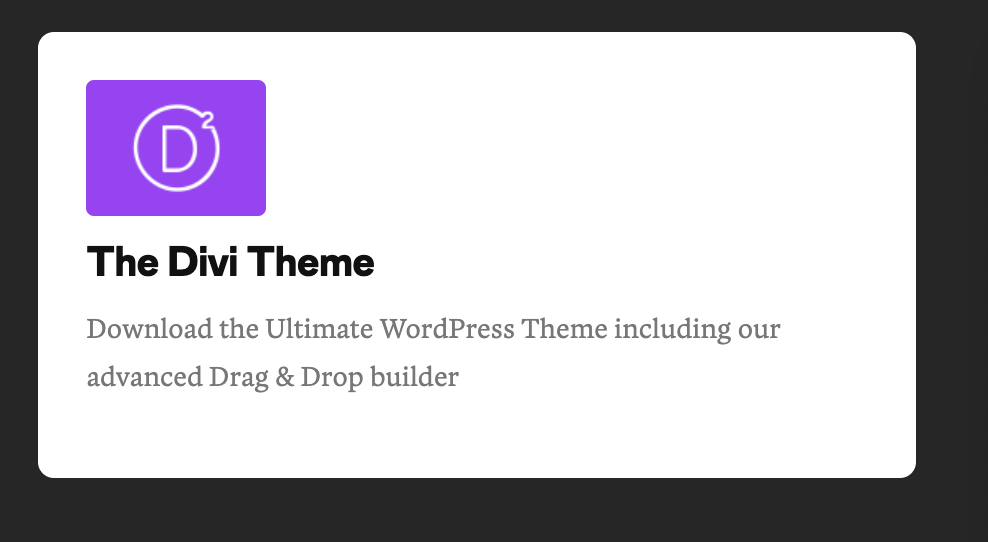
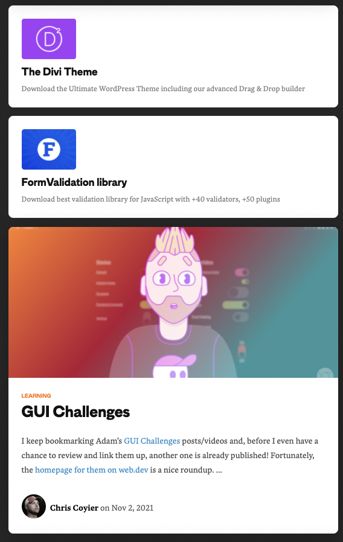
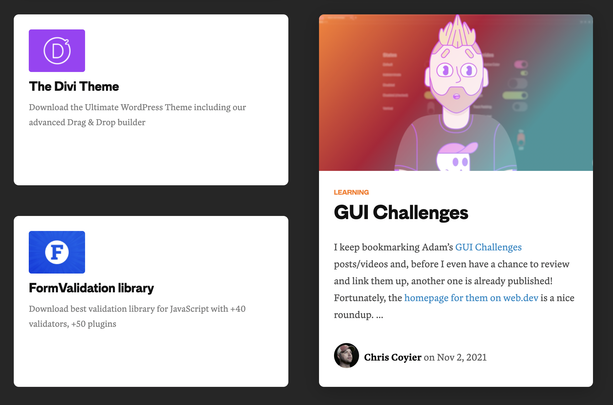

# Ejercicio

1. Hacer una card como la dispuesta a continuacion (Avatar, titulo, subtitulo )



2. Hacer una card como la dispuesta a continuacion (Imagen, etiqueta(label), titulo, parrafo, avatar, leyenda)


3. Juntar las tarjetas y armar la siguiente publicacion en el centro de un html, las mismas ocuparan el 95% del width total de la pantalla



4. : @media queries!! : hasta los 574px las tarjetas se mostraran igual que en el punto tres, al crecer mas de 574px se mostraran de la siguiente forma
** El ancho maximo sera de 930px, deberan estar centradas dentro del html




---

```
    familia de fuentes: MD Primer Bold,Rubik,Lato,Lucida Grande,Lucida Sans Unicode,Tahoma,Sans-Serif;
    color de fondo: #262626;
    color de fondo de tarjeta: #ffffff;
    color titulos: #111;
    color de texto en tarjeta chica: #777;
    color de etiqueta: #ff7a18;
    color de texto en tarjeta grande: #474747;
    color de link embebido en parrafo: #0089c7;
```