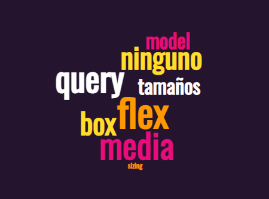

## CSS

        box-model > concepto
        box sizing: border-box vs content-box
        tamaños > concepto atado a box model
        media query > practica

  

### box-model

    Es un concepto sobre el cual se trabaja, y que se utiliza para darle forma a un elemento.
    Poder entender que box-model es un concepto es fundamental para entender CSS.
    Nos sirve para entender que los elementos dispuestos siempre son cajas, y que cada uno de ellos tiene un tamaño, y con estilos les daremos su propio tamaño, por más de cambiar su forma (por ejemplo con una imagen de border-radius: 50%), su contenedor continuará siendo una caja.

### box sizing: border-box vs content-box

    La diferencia entre border-box y content-box es que el contenido de un elemento se ajusta al tamaño de la caja, y el contenedor siempre será una caja.

    content-box: el contenido de un elemento se ajusta al tamaño del contenedor.
    border-box: el contenido de un elemento se ajusta al tamaño de la caja.

### tamaños

    width es el ancho del elemento.
    height es el alto del elemento.
    min-width es el ancho mínimo del elemento.
    min-height es el alto mínimo del elemento.
    max-width es el ancho máximo del elemento.
    max-height es el alto máximo del elemento.
    margin es el margen del elemento, se ubica por fuera del borde, no es considerado parte del border-box.
    padding es el padding del elemento, se ubica por dentro del borde, es parte del elemento considerado en border-box.
    border es el borde del elemento, es parte del elemento considerado en border-box.
    contenido es el contenido del elemento, es parte del elemento considerado en border-box.

### media query

    Es una condición (generalmente un breakpoint) que se cumple para que un elemento se muestre, se deje de mostrar, o se modifique.
    Se puede utilizar para darle forma a un elemento en una pantalla pequeña, o en una pantalla grande.
